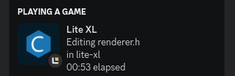

# Discord presence for lite-xl

This only works on Linux; if you're on something else, use [litepresence](https://github.com/TorchedSammy/litepresence).

This plugin displays what file you're editing and your directory in your Discord rich presence.



You can customize the RPC messages by setting `config.discord_rpc`. The default config looks like this:

```lua
local config.discord_rpc = {
    application_id = "749282810971291659",
    editing_details = "Editing %f",
    idle_details = "Idling",
    lower_editing_details = "in %w",
    lower_idle_details = "Idle",
    elapsed_time = true,
    idle_timeout = 30,
    autoconnect = true,
    reconnect = 5
}
```
